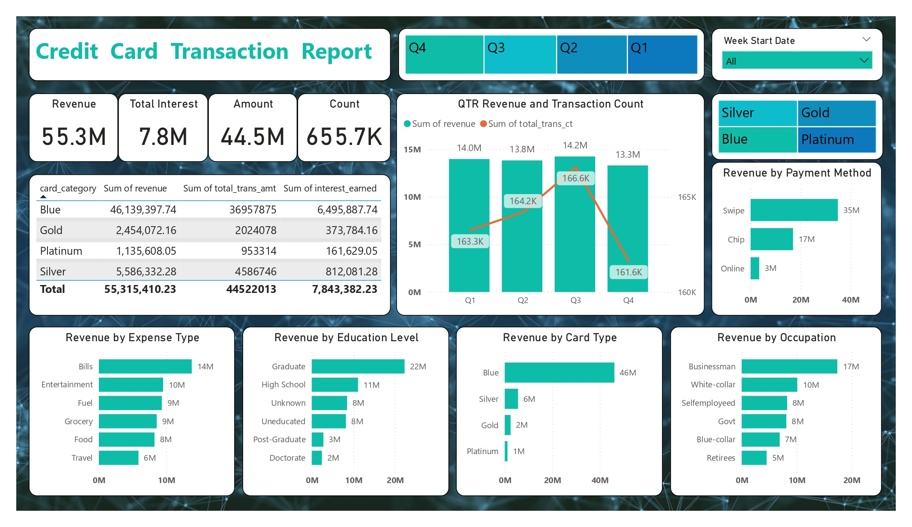

# Credit Card Transaction Report

## Description

This project focuses on analyzing a dataset of credit card transactions and developing interactive Power BI dashboards to extract meaningful insights.


## Dashboards Preview



## Technologies Used

- Python, Pandas, NumPy for data manipulation
- Docker for database server hosting
- PostgreSQL for database management
- Microsoft PowerBI for data visualization

## Folder Structure

```
📂 Credit-Card-Transaction-Report
 ├── 📂 dashboards                                   # PDF version of the dashboards
 ├── 📂 data                                         # The datasets for this project
 ├── 📂 images                                       # The images supporting this project 
 ├── 📂 sql srcipts                                  # SQL scripts for database creation and management
 ├── 📜 .gitignore                                   # Speciafy untracked directories by Git
 ├── 📜 Credit-Card-Transaction-Report.pbix          # The original PowerBI dashboard file
 ├── 📜 README.md                                    # Project documents
 ├── 📜 docker-compose.yaml                          # Script for setting up Docker container
 ├── 📜 format_datestyle.ipynb                       # Notebook for data transformation
 ├── 📜 requirements.txt                             # Required packages for this project
```
