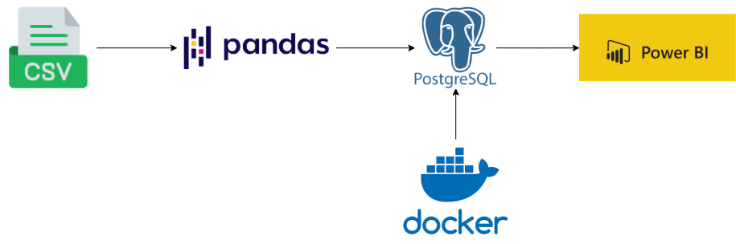

# 💳 Credit Card Transaction Report

## Overview

The problem addressed in this project is the need to analyze and extract valuable insights from a large dataset of over 10,000 credit card transaction records. Efficient data transformation, storage, and visualization are essential for detecting patterns and improving decision-making.

This approach is both stable and sustainable, leveraging Python for robust data processing, PostgreSQL for scalable and efficient storage, and Docker for a portable, consistent environment. The use of Docker ensures that the pipeline can be easily deployed and maintained, providing flexibility and reproducibility for future iterations.

The tech stack was chosen for its reliability and scalability. Python (Pandas, NumPy) is well-suited for data manipulation and transformation. PostgreSQL offers a powerful, open-source database solution that ensures structured data management and fast querying, while Docker ensures ease of deployment across different environments. Power BI was selected for its interactive, user-friendly dashboards, enabling clear, actionable insights. This combination provides a strong foundation for sustainable data pipeline development and visualization.

## Datasets Summary

This project utilizes transaction and customer data from 2023:

1️ **credit_card.csv** – Transaction records for the entire year.

- *Client_Num* serves as a foreign key.

2️⃣ **customer.csv** – Demographic details of customers who made transactions.

- *Client_Num* is the primary key.

3️⃣ **cc_add.csv** and **cust_add.csv** - Additional data for main datasets

## Workflow Design



1️ Python, Pandas, NumPy for data cleaning and transformation.

2️⃣ Docker for database server hosting.

3️⃣ PostgreSQL for database management.

4️⃣ Microsoft PowerBI for data visualization.

## Preview


## 📊 Insights from the Credit Card Transaction Report

1️ Overall Performance

- Total Revenue: $55.3M

- Total Transactions: 655.7K

- Total Amount Transacted: $44.5M

- Total Interest Earned: $7.8M

➡️ Quarterly Trends: Revenue remains stable across Q1 to Q4, with Q3 having the highest revenue and transaction count.

2️⃣ Card Category Performance

- Blue Cards dominate with $46.1M in revenue, the highest transaction volume, and interest earned.

- Silver Cards follow with $5.6M in revenue.

- Gold ($2.4M) and Platinum ($1.1M) cards have lower contributions.

➡️ Blue Cards are the most widely used, while premium cards (Gold & Platinum) cater to a niche audience.

3️⃣ Payment Method Preference

- Swipe Payments are the most popular, generating $35M in revenue.
  
- Chip-based transactions account for $17M.
  
- Online payments are the least preferred at $3M.
  
➡️ Customers prefer physical card transactions over digital payments.

4️⃣ Customer Demographics

- By Occupation:
  
  - Businessmen contribute the highest revenue ($17M), followed by White-collar workers ($10M).
  
  - Retirees generate the least revenue ($5M).

- By Education Level:

  - Graduates are the highest spenders ($22M), followed by High School ($11M) and Unknown ($8M).

  - Doctorate holders contribute the least ($2M).

➡️ Higher education correlates with increased spending.

5️⃣ Spending Behavior

- Bills (Utilities, rent, etc.) contribute the highest revenue ($14M).

- Entertainment ($10M), Fuel ($9M), Grocery ($9M), and Food ($8M) are also significant.

- Travel spending is the lowest ($6M).

➡️ Essential expenses drive most of the transactions.

6️⃣ Card Type Preference

Blue Cards dominate the market with $46M in revenue.

## Project Structure

```
📂 Credit-Card-Transaction-Report
 ├── 📂 dashboards                                  # PDF version of the dashboards
 ├── 📂 data                                        # The datasets for this project
 ├── 📂 images                                      # The images supporting this project 
 ├── 📂 sql srcipts                                 # SQL scripts for database creation and management
 ├── 📜 .gitignore                                  # Speciafy untracked directories by Git
 ├── 📜 Credit-Card-Transaction-Report.pbix         # The original PowerBI dashboard file
 ├── 📜 README.md                                   # Project documents
 ├── 📜 docker-compose.yaml                         # Script for setting up Docker container
 ├── 📜 format_datestyle.ipynb                      # Notebook for data transformation
 ├── 📜 requirements.txt                            # Required packages for this project
```
